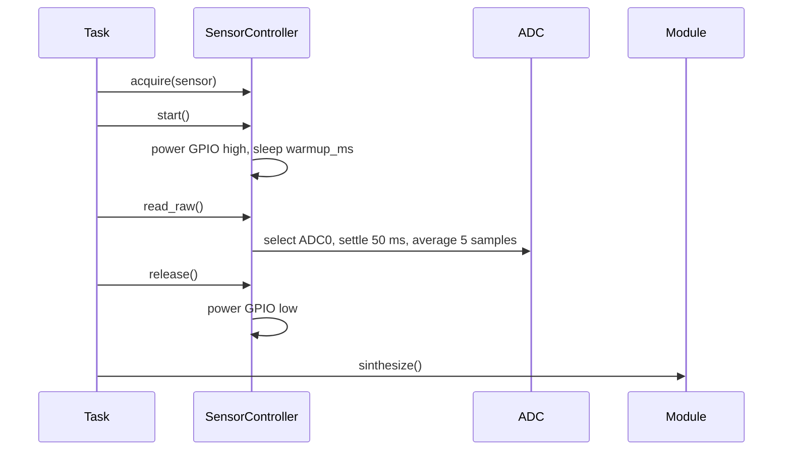
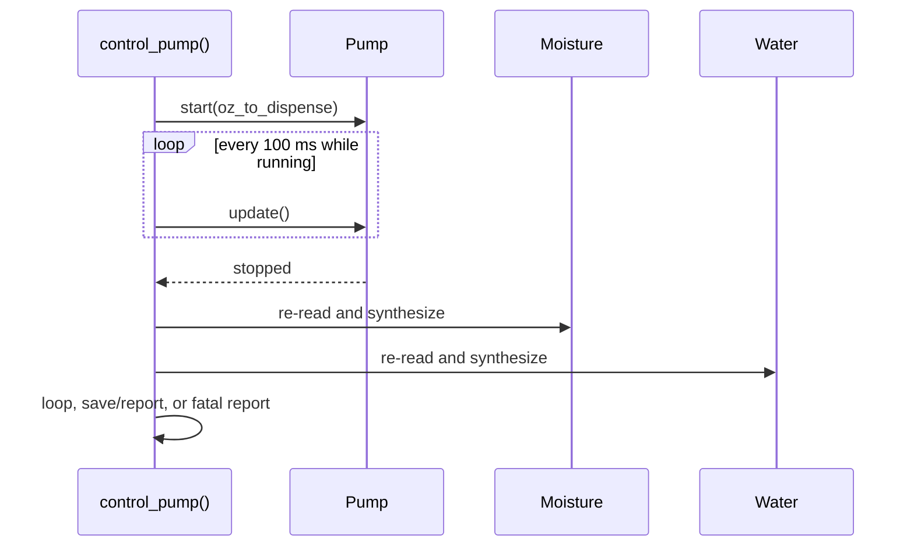
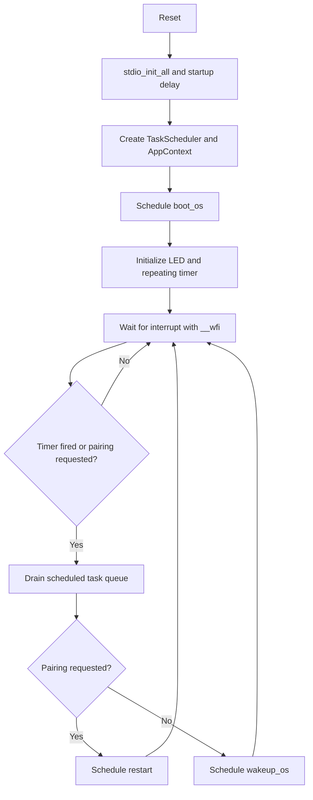
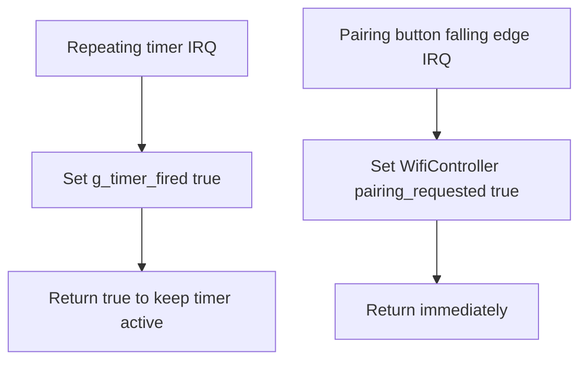
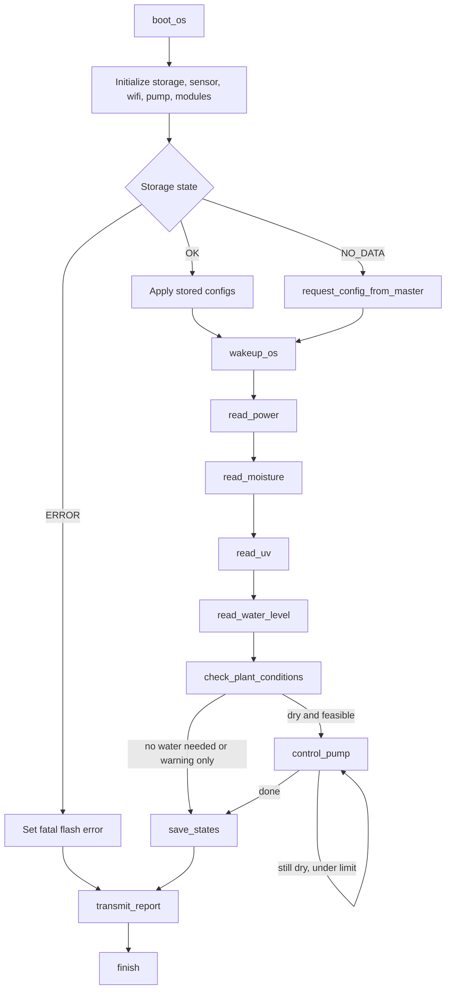
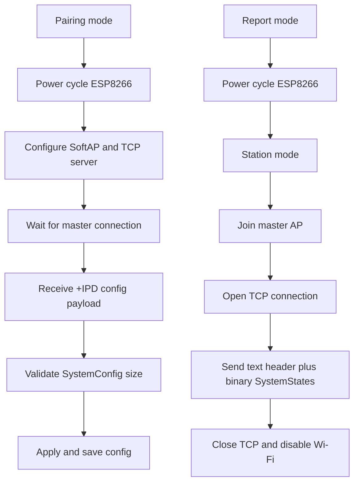
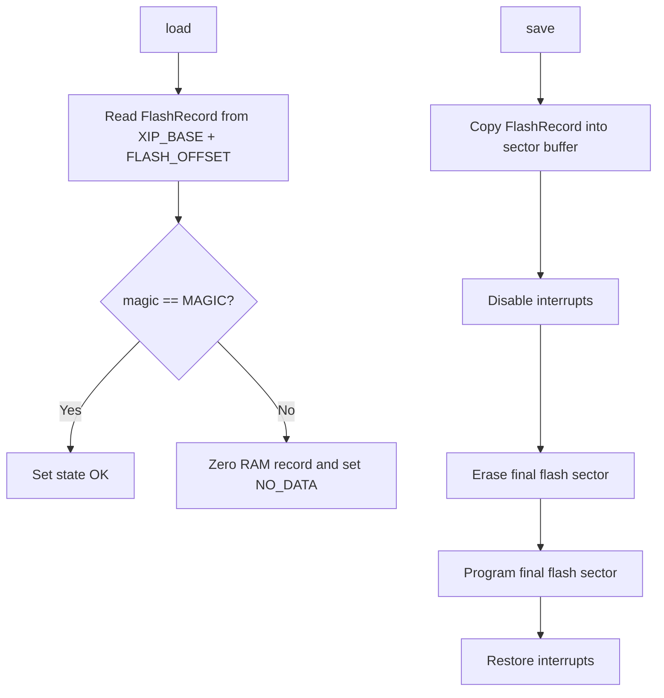

# Memory, Reliability, Timing, And Software Support

## Memory Requirements

This firmware is intended for the Raspberry Pi Pico RP2040 target and uses static or stack-owned objects instead of dynamic allocation for the core irrigation control path. Program memory is the compiled `Irrigation` executable plus linked Pico SDK drivers for GPIO, ADC, UART, timers, flash, sync, and stdio. Persistent data reserves the final flash sector through `StorageController::FLASH_OFFSET = PICO_FLASH_SIZE_BYTES - FLASH_SECTOR_SIZE`; on the Pico this sector is normally 4096 bytes. The saved record must fit in one flash sector, enforced by `static_assert(sizeof(StorageController::FlashRecord) <= FLASH_SECTOR_SIZE)`.

| Area | Requirement |
| --- | --- |
| Program flash | Firmware image, C++ runtime used by the build, Pico SDK drivers, and application code. Exact size is produced by the CMake build outputs. |
| Persistent flash | One final flash sector for `StorageController::FlashRecord`. |
| Main RAM object | `AppContext`, which owns Wi-Fi, pump, storage, sensor controller, modules, and `RunReport`. |
| Scheduler RAM | Ten task-function pointers plus `head`, `tail`, and `count`. |
| UART/config buffers | Temporary `std::string` objects for AT responses, config payloads, and report packets. |
| Sensor data | Per-module `Config`, `State`, and `SensorController::Sensor` records. |
| Flash staging buffer | `uint8_t sector_buffer[FLASH_SECTOR_SIZE]` on the stack during `StorageController::save()`. |

The global and static variables are intentionally limited. `g_timer_fired` is a volatile flag set by the repeating timer ISR. `g_pair_button_pressed` is declared in `Main.cpp` but is currently unused. `WifiController::pairing_requested` is an inline static flag set by the pairing GPIO ISR and consumed by the main loop. `pump_cycles` is a static local counter in `Tasks::control_pump()` used to bound repeated watering attempts. The code also uses `WIFI_UART` as a macro alias for `uart0`, which has no RAM cost.

```cpp
static volatile bool g_timer_fired = false;
inline static bool WifiController::pairing_requested = false;
static int pump_cycles = 0;
```

## Reliability And Design Criteria

The design favors deterministic embedded behavior: the scheduler is fixed-size, tasks are cooperative, interrupts only set flags, sensors are powered only while being read, and flash persistence is isolated in one controller. The shared ADC controller reduces pin and ADC setup duplication, and the module split keeps raw hardware acquisition separate from value synthesis and decision logic. Fatal conditions such as critically low power and sensor failures transition to report transmission and then panic, preventing the pump from continuing in an unknown state.

Efficiency considerations include sleeping with `__wfi()` between events, disabling sensor GPIO power outside read windows, averaging ADC samples to reduce noise, and keeping ISR bodies short. Compliance and maintainability criteria include using C++17 only, preserving the Pico SDK 2.2.0 CMake flow, keeping public interfaces in `include/`, matching paired header/source modules, and avoiding real Wi-Fi credentials in committed defaults. Compatibility-sensitive items are the flash record layout, `StorageController::SystemConfig`, `StorageController::SystemStates`, GPIO pin assignments, ADC calibration constants, and the raw binary protocol exchanged with the ESP32 master.

```cpp
static_assert(
  sizeof(StorageController::FlashRecord) <= FLASH_SECTOR_SIZE,
  "FlashRecord must fit inside one flash sector"
);
```

## Base Times And Timing Analysis

The main wake source is a repeating timer. The comment describes a 60-second timer, while the active code currently uses `add_repeating_timer_ms(-10000, ...)`, so the implemented base period is 10 seconds. A negative period schedules the next callback relative to the intended previous callback time. After wakeup, the loop drains all scheduled tasks, and those tasks may block while sensors warm up, ADC samples are averaged, Wi-Fi waits for AT responses, flash is programmed, or the pump completes a timed dose.

| Timing Item | Current Value Or Formula | Notes |
| --- | --- | --- |
| Boot stdio wait | 5000 ms | Startup delay before constructing app context. |
| Main timer period | 10000 ms active, 60000 ms commented | Drives recurring irrigation cycles. |
| LED task indicator | 500 ms | Runs after each executed task. |
| Soil moisture warmup | 500 ms default | Stored in sensor descriptor and config. |
| Power warmup | 100 ms default | Sensor powered before ADC read. |
| UV warmup | 100 ms default | Sensor powered before ADC read. |
| Water warmup | 100 ms default | Sensor powered before ADC read. |
| ADC settle time | 50 ms | Before sample averaging. |
| ADC averaging | 5 samples, 100 ms between samples | About 500 ms sampling time per sensor, plus settle and warmup. |
| Pump loop poll | 100 ms | `control_pump()` calls `pump.update()` until stopped. |
| Pump duration | `(ounces / flow_rate_oz_per_sec) * 1000` | Pump run time depends on received configuration. |
| Max pump cycles | 5 | Bounds repeated dosing in one wake cycle. |
| Wi-Fi power cycle | 1000 ms off + 3000 ms on | Used before pairing or master connection. |
| Config receive timeout | 60000 ms | Waits for master payload in pairing mode. |
| UART read polling | 5 ms | Poll delay inside `uart_read_for()`. |
| Master Wi-Fi join timeout | 15000 ms | AT command wait while joining AP. |
| TCP connect timeout | 5000 ms | AT command wait for `CIPSTART`. |

The nominal no-pump sensor path is approximately the sum of sensor warmups and ADC reads: power about 650 ms, moisture about 1050 ms, UV about 650 ms, and water about 650 ms, before task LED indications and logging overhead. With four task LED toggles at 500 ms each, the visible diagnostic delay adds roughly 2 seconds. Wi-Fi reporting can add several seconds because `connect_to_master()` power-cycles the ESP8266, resets it, joins the AP, opens TCP, sends the payload, and closes the connection. Pumping dominates timing when soil is dry, because each dose blocks until the configured pump duration ends and can repeat up to five times.

```cpp
state.duration_ms =
    static_cast<uint32_t>((ounces / config.flow_rate_oz_per_sec) * 1000.0f);
```

## Signal Timing And Sequencing

Analog sensor sequencing follows a strict acquire/start/read/release pattern. The module task acquires the sensor descriptor, enables the sensor power pin, waits for warmup, waits an additional ADC settle delay, averages five readings, stores the raw value, disables the power pin, and synthesizes engineering units. The ADC input is fixed at GPIO26/ADC0, while each sensor has its own power GPIO.



Pump sequencing is time-based. `Tasks::control_pump()` computes a dose, starts the pump, blocks in a 100 ms polling loop, and lets `PumpController::update()` stop the pump when elapsed time reaches the configured duration. After each pump cycle, the firmware immediately re-reads moisture and water level before deciding whether to schedule another pump cycle or finish the report path.



## Software Support

### Main Support Flow



### ISR Support Flow



The interrupt service routines are deliberately minimal. The timer callback only marks that the main loop should drain the queue, and the Wi-Fi pairing callback only marks that pairing was requested. Neither ISR performs flash, Wi-Fi, pump, ADC, or scheduler operations.

### Function-Level Module Flow



### Wi-Fi Support Flow



### Flash Support Flow



## Open Design Notes

The active code says the timer callback fires every 60 seconds, but the configured value is 10 seconds. The water-level fatal error check is currently commented out in `Tasks::read_water_level()`. `StorageController::save()` mentions a checksum in the header comment, but the implementation currently validates only the magic value. These are documentation-relevant design notes and should be resolved in code or tracked as known limitations before final firmware release.
