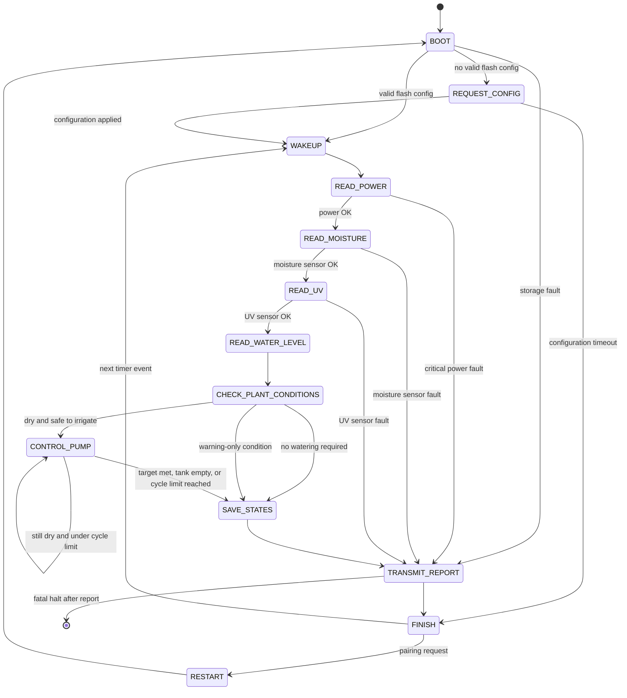

# Irrigation Firmware Software Design

## System Summary

The Irrigation firmware is an embedded Raspberry Pi Pico application that operates a self-contained plant irrigation node. The system receives operating configuration from a master ESP32 through an ESP8266 Wi-Fi link, stores that configuration in nonvolatile flash, periodically measures plant and system conditions, and actuates a water pump when irrigation is required. The firmware is organized around low-power timed wakeups, short interrupt handlers, cooperative task scheduling, ADC-based sensor acquisition, GPIO-controlled power switching, and UART-based Wi-Fi communication. Its primary output is both physical irrigation and a state report transmitted back to the master controller after each operating cycle.

## Architectural Overview

The firmware uses a cooperative embedded architecture instead of an RTOS. A repeating hardware timer and the Wi-Fi pairing GPIO interrupt only set flags, while the main loop wakes with `__wfi()` and executes scheduled tasks in normal thread context. This keeps interrupt service routines deterministic and prevents long-running operations such as flash writes, Wi-Fi communication, ADC sampling, or pump control from running inside an ISR. The result is a simple event-driven firmware design suitable for a small microcontroller with limited RAM and predictable timing needs.

The application is divided into controllers and modules. Controllers manage shared platform services such as scheduling, storage, analog acquisition, Wi-Fi communication, and pump actuation. Modules represent physical sensing subsystems such as soil moisture, UV, water level, and power monitoring. Tasks coordinate these classes into the firmware workflow, converting independent module states into the final irrigation decision and communication report.

## Module And Controller Design

### AppContext

`AppContext` is the central runtime context passed through every scheduled task. It aggregates all controllers, sensing modules, the scheduler pointer, and the current cycle report into one object so the firmware can avoid global ownership of application components. This design is useful in embedded software because it makes task dependencies explicit while keeping object allocation static and predictable. The context also provides a single integration point for future modules without changing the task function signature.

### RunReport

`RunReport` stores the operational result of one wake cycle. It records whether a fatal error occurred, stores one fatal message, and accumulates a bounded set of warnings that can be transmitted to the master. The bounded warning storage avoids dynamic growth and keeps memory use deterministic. This report separates fault collection from communication, allowing sensor and pump tasks to describe problems while the Wi-Fi task handles final transmission.

### TaskScheduler

`TaskScheduler` is a fixed-capacity cooperative scheduler. It stores task function pointers in a circular FIFO queue and lets each task schedule the next task in the workflow. This approach gives the firmware a state-machine structure without requiring threads, heap allocation, or an RTOS. The queue limit also provides an embedded safety boundary: scheduling failure is possible when too many tasks are queued, so task chains are kept short and sequential.

### Tasks

`Tasks` is the firmware orchestration layer. It defines the operating states of the irrigation node: boot, configuration acquisition, sensor reading, plant-condition evaluation, pump control, persistence, reporting, restart, and finish. Each task performs one high-level operation and then schedules the next operation, forming a cooperative finite state machine. This design keeps the main loop generic while keeping the application behavior visible in one module.

```cpp
namespace Tasks {
  void boot_os(AppContext &ctx);
  void request_config_from_master(AppContext &ctx);
  void wakeup_os(AppContext &ctx);
  void read_power(AppContext &ctx);
  void read_moisture(AppContext &ctx);
  void read_uv(AppContext &ctx);
  void read_water_level(AppContext &ctx);
  void check_plant_conditions(AppContext &ctx);
  void control_pump(AppContext &ctx);
  void save_states(AppContext &ctx);
  void transmit_report(AppContext &ctx);
  void restart(AppContext &ctx);
  void finish(AppContext &ctx);
}
```

### SensorController

`SensorController` manages the shared analog acquisition path for all ADC-based sensors. The Pico uses one ADC input for the sensor chain, while each sensor module provides its own GPIO power pin and warmup requirement. The controller enforces an acquire, power, sample, and release pattern so only one analog sensor is active during a reading. This reduces unnecessary current draw, limits sensor interference, and centralizes ADC sampling behavior for the entire firmware.

The same acquisition pattern is repeated by the sensor tasks and is described once here as a shared design rule:

```cpp
ctx.sensor.acquire(&ctx.moisture.sensor);
ctx.sensor.start();
ctx.sensor.read_raw();
ctx.sensor.release();
ctx.moisture.sinthesize();
```

### SoilMoistureModule

`SoilMoistureModule` represents the soil moisture sensing subsystem. It owns the calibration values that map raw ADC readings into a plant moisture percentage and determines whether the soil is below the configured irrigation threshold. Its state is used as the primary input to the plant watering decision. In embedded terms, this module converts a noisy analog sensor into a stable application-level condition: dry or sufficiently moist.

### WaterLevelModule

`WaterLevelModule` represents the reservoir monitoring subsystem. It converts the tank sensor reading into an estimated remaining water volume based on configured tank capacity. The irrigation decision uses this state to prevent pump operation when there is no usable water and to cap a requested dose to the available supply. This module provides an actuator safety input, because running a pump dry can damage hardware and waste battery power.

### UVModule

`UVModule` represents the UV exposure sensing subsystem. It converts the analog UV sensor reading into a UV index and compares that value against a configured alert threshold. The UV result does not directly drive the pump, but it contributes environmental state and warnings to the master controller. This preserves visibility into plant exposure conditions while keeping irrigation control focused on moisture and water availability.

### PowerModule

`PowerModule` represents the battery and power-health monitoring subsystem. It estimates supply voltage and battery percentage using the ADC reading and voltage-divider configuration. Its warning and error states protect the irrigation node from operating when power is low or critically unsafe. In the task workflow, a critical power condition stops the normal irrigation sequence and moves directly to reporting.

### PumpController

`PumpController` represents the water pump actuator subsystem. It converts a requested water dose into a timed GPIO activation based on configured flow rate. The controller tracks whether the pump is running, when it started, the intended run duration, and the estimated total volume dispensed. This provides open-loop dosing appropriate for a small embedded irrigation system where flow is calibrated rather than measured in real time.

### StorageController

`StorageController` manages nonvolatile configuration and state persistence in onboard flash. It stores a complete record containing Wi-Fi settings, pump settings, sensor configuration, and the most recent module states. A magic value validates whether flash contains usable data before configuration is applied to live modules. This controller is compatibility-sensitive because changes to the stored record layout affect the binary protocol and previously saved flash data.

### WifiController

`WifiController` manages the ESP8266 communication interface using UART commands and an enable GPIO. It supports pairing mode, where the Pico creates a temporary Wi-Fi access point and waits for the master to provide configuration, and reporting mode, where the Pico connects back to the master and sends the current system state. The pairing button interrupt only sets a request flag, and the actual Wi-Fi sequence runs later in task context. This design keeps radio communication out of ISRs and allows the Wi-Fi module to be power-cycled when not needed.

### Main Runtime

`Main.cpp` is the firmware runtime entry point. It initializes stdio, creates the static scheduler and application context, schedules the boot task, configures the onboard LED, and starts the repeating timer used for periodic operation. The main loop sleeps until a timer or pairing event occurs, then drains the scheduler queue and schedules the next wake cycle or restart path. This runtime structure is the embedded control shell around the task-based state machine.

## Firmware Task Workflow

The firmware workflow is a cooperative finite state machine implemented through scheduled tasks. On reset, the system enters `BOOT`, initializes hardware-facing controllers and modules, and determines whether valid configuration exists in flash. If configuration is available, the firmware applies it and enters the normal wake cycle; if no configuration exists, the firmware enters Wi-Fi pairing so the master ESP32 can send the required operating parameters. If storage reports an unrecoverable fault, the system prepares an error report instead of starting irrigation logic.

During a normal wake cycle, `WAKEUP` clears the previous report and begins a fixed sensor sequence: power, soil moisture, UV, and water level. The plant decision state evaluates whether the soil is dry, whether water is available, and whether the pump flow rate is configured. If irrigation is needed and allowed, the pump state dispenses one calibrated dose, rechecks moisture and reservoir level, and repeats only up to the configured maximum cycle limit. Every successful or warning-only path saves the latest states to flash and transmits a report to the master; fatal paths transmit an error report and then halt to avoid unsafe autonomous behavior.



The recurring task sequence can be summarized by the following embedded control flow. The scheduler does not decide plant behavior by itself; it only executes queued states. The task implementation is responsible for selecting the next state based on sensor state, configuration validity, warnings, and fatal errors.

```cpp
void Tasks::wakeup_os(AppContext &ctx) {
  ctx.report.clear();
  ctx.scheduler->schedule(Tasks::read_power);
}

void Tasks::check_plant_conditions(AppContext &ctx) {
  if (!ctx.moisture.state.is_dry) {
    ctx.scheduler->schedule(Tasks::save_states);
    ctx.scheduler->schedule(Tasks::transmit_report);
    return;
  }

  ctx.scheduler->schedule(Tasks::control_pump);
}
```

## Communication Design

The Wi-Fi communication design separates configuration input from state reporting output. During initial setup or restart, the Pico enters pairing mode and waits for a binary configuration payload from the master. During normal operation, the Pico builds a report containing a text status header followed by the binary system state structure and sends it back to the master over TCP. This design reduces parsing overhead on the Pico but requires the ESP32 master and Pico firmware to agree on structure size, layout, and field meaning.

## Persistence Design

The persistence design stores both configuration and recent state in a single flash record. Configuration allows the irrigation node to resume autonomous operation after reset without requiring pairing every time. Recent state gives the master continuity across cycles and allows diagnostic review of the last measured power, moisture, UV, water, and pump conditions. Flash writes are grouped at the end of the cycle so the system avoids writing after every individual sensor reading.

## Safety And Fault Behavior

The firmware distinguishes warnings from fatal errors. Warnings such as low battery, high UV, empty tank, unconfigured pump flow, or maximum pump cycles are reported to the master while allowing the firmware to complete its cycle. Fatal errors such as critical power failure, required sensor failure, or flash read failure bypass normal irrigation and prioritize reporting. After a fatal report is attempted, the firmware halts so it does not continue watering from an invalid or unsafe state.

## Design Notes

The active timer value is 10 seconds, while the surrounding comment describes a 60-second operating period. The water-level fatal error path exists conceptually but is currently disabled in the task implementation. The storage interface comment refers to checksum validation, while the implemented validation uses a magic value only. These items should be treated as design alignment issues before a release build is considered final.
